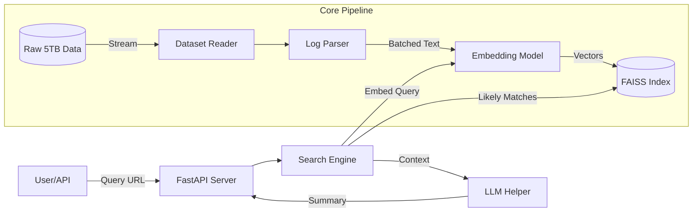

# Scalable Malware Link Detection System

## Overview
This project implements a production-grade detection system for malicious links. It leverages **Vector Embeddings** to find semantically similar malicious links from a massive labeled dataset (up to 5TB) and uses an **LLM** (Large Language Model) to summarize the potential threat.

## System Architecture



## Implementation Flow: Step-by-Step

The system is built using a modular "Clean Architecture" pattern. Here is how the components interact:

### 1. Data Ingestion (Streaming)
**Goal**: Handle terabytes of data without running out of RAM.
- **Implementation**: `src/ingestion/reader.py`
- **How it works**: The `DatasetReader` uses Python **generators** (`yield`) to read the file line-by-line. It never loads the whole file into memory.
- **Parser**: `src/ingestion/parser.py` handles the cleaning of the crude `url:email:metadata` format into structured objects.

### 2. Embedding (Vectorization)
**Goal**: Convert text URLs into machine-understandable numbers.
- **Implementation**: `src/embedding/embedder.py`
- **Model**: Uses `sentence-transformers/all-MiniLM-L6-v2`. This model is lightweight and fast.
- **Batching**: We process URLs in batches (e.g., 32 or 100 at a time) to maximize CPU/GPU throughput.

### 3. Storage (Vector Database)
**Goal**: Store millions of vectors and search them efficiently.
- **Implementation**: `src/storage/vector_db.py`
- **Technology**: **FAISS** (Facebook AI Similarity Search).
- **Index Type**: Currently uses `Flat` (Exact search) or `IVF` (Inverted File) for speed. It supports saving/loading indexes to disk (`.index` files).

### 4. Search & Analysis
**Goal**: Find similar threats and explain them.
- **Implementation**: `src/analysis/search_engine.py` & `llm_helper.py`
- **Logic**:
    1.  User sends a URL.
    2.  `SearchEngine` converts the URL to a vector.
    3.  Queries FAISS for the "Nearest Neighbors" (most similar known malicious links).
    4.  `LLMHelper` takes these neighbors and prompts an LLM to generate a human-readable summary of *why* this link looks suspicious.

## Key Functions & Classes

- **`DatasetReader.read_batch(batch_size)`**: Vital for ETL. Yields chunks of valid `LogEntry` objects.
- **`EmbeddingModel.encode(texts)`**: Wrapper around the transformer model. returns `numpy` arrays.
- **`VectorDB.add(vectors)`**: Adds embeddings to the FAISS index. Trains the index if necessary (for IVF).
- **`SearchEngine.search(query)`**: The high-level entry point for queries. Coordinates the embedder and the database.

## How to Run

### Prerequisities
```bash
pip install -r requirements.txt
```

### 1. ETL Pipeline (Ingest Data)
Process raw data and build the search index.
```bash
python scripts/run_pipeline.py
```
*This reads `data/raw/sample_test.txt` (or your big file) and saves the index to `data/indexes/main.index`.*

### 2. Verify System
Run a quick test to see the logic in action locally.
```bash
python scripts/verify_full_system.py
```

### 3. Start API
Run the production server.
```bash
uvicorn src.api.main:app --reload
```
